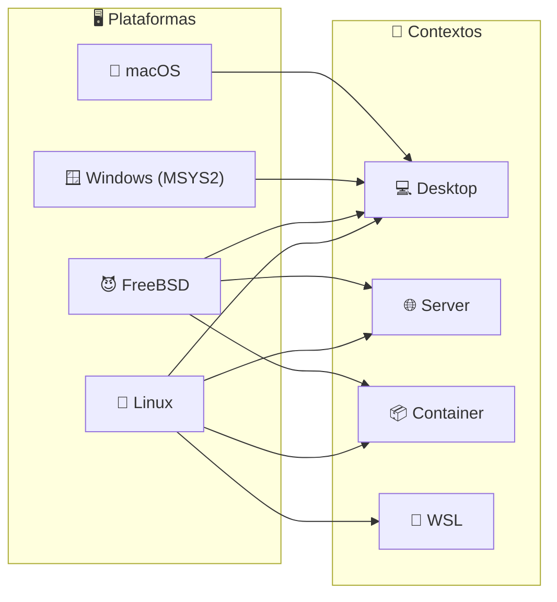
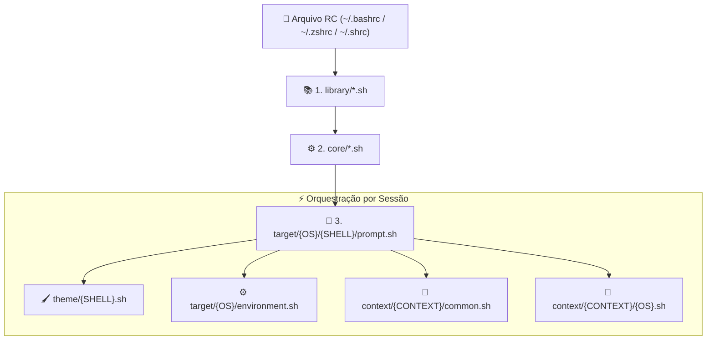

# 🐚 Universal Shell Environment

> Configurações, aliases e prompts centralizados para todos os seus ambientes de sistema, mantendo a experiência consistente seja no Desktop, Servidor, Contêiner ou WSL. Componente de runtime interativo do **Quarteto de Produtividade**.

---

### 🏛️ O Quarteto de Produtividade

[](https://github.com/GabrielFrigo4/setup)
[](https://github.com/GabrielFrigo4/shell)
[](https://github.com/GabrielFrigo4/vault)
[](https://github.com/GabrielFrigo4/profile)

> 📖 **Arquitetura Unificada do Ecossistema:** Conheça a matriz completa de responsabilidades, ciclo de boot e segregação de privilégios em [ENVIRONMENT.md](ENVIRONMENT.md).
> 📜 **Princípios de Engenharia:** Conheça os 18 princípios UNIX e boas práticas Clean Code em [PRINCIPLES.md](PRINCIPLES.md).

---

### 🖥️ Sistemas, Contextos & Shells


[](https://github.com/GabrielFrigo4/shell/actions/workflows/ci.yml)



---

## 🚀 Instalação Rápida

O instalador aceita a flag `--context` (`desktop`, `server`, `container`, `wsl`). Se omitido, assume `desktop`.

### 🐧 Linux / 😈 FreeBSD / 🍎 macOS

```sh
sudo git clone "https://github.com/GabrielFrigo4/shell" "/usr/local/share/shell"
bash "/usr/local/share/shell/install.sh" --context desktop
```

### 🪟 Windows (MSYS2)

```sh
git clone "https://github.com/GabrielFrigo4/shell" "${HOME}/.shell"
bash "${HOME}/.shell/install.sh" --context desktop
```

---

## ⚡ Comandos Mais Usados

| Comando / Alias | Ação | Destino |
| :--- | :--- | :--- |
| `update-all` / `upall` / `u` | **Orquestrador Global:** Atualiza SO + AUR + Flatpak + Snap. | Universal |
| `update-shell` / `upsh` | Atualiza o repositório do shell (`git pull`) e recarrega a sessão. | Universal |
| `update-vault` / `upvt` | Sincroniza segredos (`~/.vault`) e recarrega chaves SSH. | Universal |
| `update-wifi` / `upwf` | Sincroniza credenciais Wi-Fi configuradas com o SO. | Linux, BSD, Windows |
| `editor [alvo]` / `e` | Abre o editor padrão configurado na cascata de prioridade. | `$VISUAL` / `$EDITOR` |
| `mount-device` / `mntdev` | Monta celular em `~/Device` via GVfs/KIO-FUSE/GSConnect/ADB. | Desktop |
| `l`, `ll`, `la`, `lt` | Listagem moderna com ícones e status git (`eza`/`exa`/`ls`). | Universal |
| `g <termo>` | Busca inteligente de texto em arquivos (`rg` > `grep`). | Universal |
| `c <arquivo>` | Visualizador formatado com syntax highlighting (`bat` > `cat`). | Universal |

> 📖 **Consulte o catálogo completo de atalhos e variáveis em [docs/ALIASES.md](docs/ALIASES.md).**

---

## 📚 Documentação Técnica Completa

Para aprofundar na arquitetura, comportamentos por contexto e motores de detecção:

- 🏛️ **[docs/ARCHITECTURE.md](docs/ARCHITECTURE.md)**: Ciclo de vida da sessão interativa, cascata de sourcing e orçamento de latência (&lt;50ms).
- 🎯 **[docs/CONTEXTS.md](docs/CONTEXTS.md)**: Especificação dos perfis `desktop`, `server`, `container` e `wsl`.
- 🧠 **[docs/DETECTION.md](docs/DETECTION.md)**: Reconhecimento de SOs, famílias de distros Linux, dark mode (D-Bus/XDG Portal) e integração GTK/Qt/Electron.
- 🖌️ **[docs/THEMES.md](docs/THEMES.md)**: Contratos visuais dos prompts (Bash, Zsh, Sh), paleta ANSI e fallback para TTYs puros.
- 🗺️ **[docs/ALIASES.md](docs/ALIASES.md)**: Dicionário exaustivo de comandos públicos, atalhos e variáveis de ambiente.

---

## 📁 Estrutura do Repositório



- 📚 **[library/](library/README.md)**: Biblioteca padrão com utilitários POSIX (`functions.sh`) e módulos analíticos (`detect.sh`).
- ⚙️ **[core/](core/README.md)**: Fundações do ambiente (`environment.sh`) e integração com segredos (`vault.sh`).
- 🎯 **[context/](context/README.md)**: Orquestrador de perfis operacionais (`desktop`, `server`, `container`, `wsl`).
- 🖌️ **[theme/](theme/README.md)**: Motores de renderização de prompts (Bash, Zsh, Sh).
- 🎨 **`target/`**: Configurações específicas por sistema operacional (`Linux`, `FreeBSD`, `MacOS`, `Windows`).
